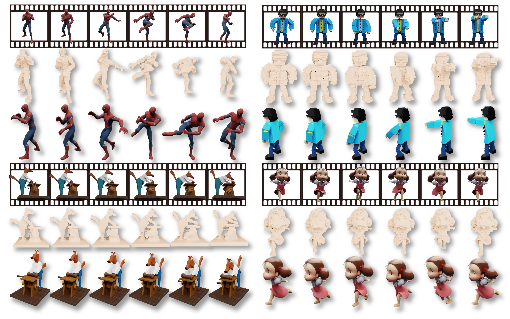

<h1 align="center">Native 4D Generative Model via Structured<br> Spacetime Latents [TOG (Siggraph Asia 2025)]</h1>
<p align="center"><a href="http://arxiv.org/abs/2512.14284"></a>
<a href='https://lizb6626.github.io/SS4D/'></a>
<a href='https://huggingface.co/lizb6626/SS4D'></a>
</p>
<p align="center"></p>

We present SS4D, a native 4D generative model that synthesizes dynamic 3D objects directly from monocular video. Unlike prior approaches that construct 4D representations by optimizing over 3D or video generative models, we train a generator directly on 4D data, achieving high fidelity, temporal coherence, and structural consistency. At the core of our method is a compressed set of structured spacetime latents. Specifically, <strong>(1)</strong> To address the scarcity of 4D training data, we build on a pre-trained single-image-to-3D model, preserving strong spatial consistency. <strong>(2)</strong> Temporal consistency is enforced by introducing dedicated temporal layers that reason across frames. <strong>(3)</strong> To support efficient training and inference over long video sequences, we compress the latent sequence along the temporal axis using factorized 4D convolutions and temporal downsampling blocks. In addition, we employ a carefully designed training strategy to enhance robustness against occlusion and motion blur, leading to high-quality generation. Extensive experiments show that SS4D produces spatio-temporally consistent 4D objects with superior quality and efficiency, significantly outperforming state-of-the-art methods on both synthetic and real-world datasets.

## TODO

- [ ] Release training pipeline
- [ ] Release data preprocessing scripts
- [x] Release inference code and pretrained model weights

## Installation

```sh
git clone --recurse-submodules git@github.com:Lizb6626/SS4D.git
cd SS4D
./setup.sh --new-env --basic --xformers --flash-attn --diffoctreerast --spconv --mipgaussian --kaolin --nvdiffrast
```

Alternatively, you can follow the detailed installation guidance provided by [TRELLIS](https://github.com/microsoft/TRELLIS/tree/main?tab=readme-ov-file#-installation).

<!-- Usage -->
## Usage

We provide a minimal example to run our method on the provided examples:
```
python test.py
```

<!-- Citation -->
## Citation

```bibtex
@article{li2025ss4d,
  author = {Li, Zhibing and Zhang, Mengchen and Wu, Tong and Tan, Jing and Wang, Jiaqi and Lin, Dahua},
  title = {SS4D: Native 4D Generative Model via Structured Spacetime Latents},
  year = {2025},
  issue_date = {December 2025},
  publisher = {Association for Computing Machinery},
  address = {New York, NY, USA},
  volume = {44},
  number = {6},
  issn = {0730-0301},
  url = {https://doi.org/10.1145/3763302},
  doi = {10.1145/3763302},
  journal = {ACM Trans. Graph.},
  month = dec,
  articleno = {244},
  numpages = {12},
  keywords = {4D generation, 3D generation, animation, generative model}
}
```
